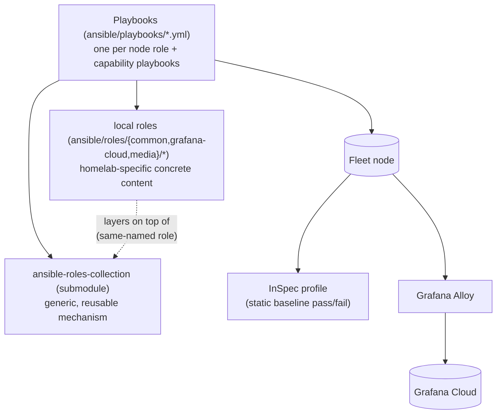
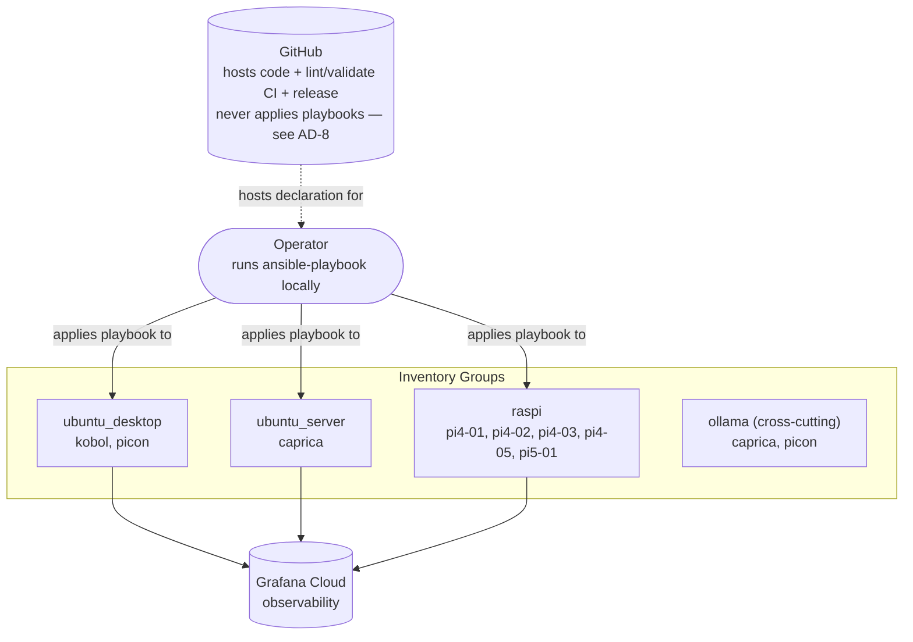

# Architecture Spine — Homelab Configs

## Design Paradigm

**Declarative convergence, dual-verified.** Every node's configuration is declared once, per node role (desktop, server, raspi), in Ansible. "Correct" means the node converges to that declaration — checked two independent ways: InSpec (static OS/security baseline, pass/fail on demand) and Grafana Alloy → Grafana Cloud (live telemetry, catches what a static baseline can't). The declaration is the only source of truth; nothing else maintains a parallel record of node state to reconcile against.



## Invariants & Rules

### AD-1 — The Ansible declaration is the single source of truth [ADOPTED]

- **Binds:** all
- **Prevents:** node-specific configuration drifting into a separate, unreconciled state store
- **Rule:** every persistent node configuration must be expressible in and derived from the Ansible declaration (playbooks, roles, vars, inventory; vault-encrypted where secret). No tool that maintains its own separate state file about node reality (e.g. Terraform-style state) is the source of truth for this system.

### AD-2 — Ansible is the default; imperative one-offs are a narrow exception [ADOPTED]

- **Binds:** all
- **Prevents:** ad hoc imperative scripts becoming the norm for anything repeatable
- **Rule:** configuration meant to run more than once, or apply to more than one node, must be an idempotent Ansible task. Imperative shell/one-off scripts are permitted only for genuinely one-time, single-node bootstrap actions (the documented manual bootstrap steps: SSH key exchange, the sudoers workaround, Docker registry login, GitHub key setup). Each permitted manual bootstrap step must be recorded in project docs with an explicit disposition — "permanently accepted" or "tracked to close" — so no manual step is left ambiguous about whether it's meant to ever go away. *Enforcement note (Deferred):* no lint/CI gate currently distinguishes a legitimate one-off from a repeatable action wrongly written as a raw shell task inside a playbook (e.g. `repositories.yml`'s `ansible.builtin.shell: gh repo edit ...` loop) — this Rule is discipline-enforced only today.

### AD-3 — Manual node drift is tolerated transiently, not permanently [ADOPTED]

- **Binds:** all
- **Prevents:** treating every manual on-node change as an incident requiring immediate reconciliation
- **Rule:** a manual change made directly on a node is acceptable as transient/debugging state. Before it's "done," it must be captured in the Ansible declaration and re-applied. InSpec and Alloy make no promise to catch drift while it's still transient. Applies uniformly across workstations, servers, and Pi nodes. **Does not apply to AD-2's bootstrap exceptions** — those are permanently manual by design (some, like Docker registry login, are never meant to be captured into Ansible; see FR-8/§4.6) and are governed by AD-2, not this rule.

### AD-4 — Role placement: submodule owns the mechanism, local roles own the concrete content [ADOPTED]

- **Binds:** `ansible/roles/*`
- **Prevents:** reusable OS-level logic leaking into homelab-specific local roles (unreusable, untestable outside this repo) and vice versa (repo-specific config bloating the reusable collection)
- **Rule:** the test is reusability to someone else, not mechanism genericity — a role belongs in the `ansible-roles-collection` submodule when it would be generally useful to another project or user independent of this specific homelab, even if implemented generically. A role belongs in local `ansible/roles/{common,grafana-cloud,media}/*` when it exists only to serve this homelab's specific needs, even if its implementation is itself parameter-driven and generic (e.g. `common/mount-disk` takes only a UUID and a path — nothing homelab-specific in the code — but stays local, because "mount an arbitrary disk" only matters here because specific Pis have specific USB drives; no other project would want this role standalone). A local role may share a submodule role's name to layer concrete content on top of a generic mechanism (e.g. `common/taskfile-dev` on `ansible-roles-collection/taskfile-dev`) — when it does, the submodule role is always included first, the local role second. *Enforcement note (Deferred):* this ordering is discipline-enforced only — no lint checks `include_role` sequence.

### AD-5 — Per-machine exceptions: three mechanisms, each fit to its trigger [ADOPTED]

- **Binds:** `ansible/playbooks/*`, `ansible/hosts.yml`
- **Prevents:** inventing a fourth ad hoc exception mechanism, or forcing an exception through the wrong one of the three
- **Rule:**
    - **(a) Per-host physical/hardware attachment** unique to one machine, with no accompanying service → an extra play scoped to that host, appended inside the group playbook (e.g. the pi4-01/pi4-02 disk-mount plays appended in `raspi.yml`, since a USB HDD is physically connected to only one Pi with no service layered on top).
    - **(b) A specific service/capability** not every node of a role needs → a playbook targeting the host(s) it applies to directly — either one named host, or the entire node-role group when the capability is opt-in and not run by the default umbrella playbook (e.g. `desktop-media.yml` targets `caprica.fritz.box` by name even though caprica is inventoried under `ubuntu_server`; `desktop-steam.yml` targets the whole `ubuntu_desktop` group since Steam applies to every desktop but isn't part of `all.yml`'s default pass). **Tiebreaker with (a):** when a hardware attachment exists solely to support a specific service (e.g. caprica's mounted disks feeding `media/jellyfin`), treat the whole thing as (b) and bundle the mount into that service's playbook — (a) is reserved for hardware attachments with no accompanying service.
    - **(c) A capability that cuts across node-role groups** → a dedicated capability group in the inventory (e.g. `ollama`) carrying its own host-vars, when the capability needs per-host inventory data. When it needs no extra host-vars — just "run on the union of these groups" — an inline group-union in the playbook's `hosts:` line (e.g. `grafana-agents.yml`'s `hosts: ubuntu_desktop:ubuntu_server:raspi`) is equivalent and does not require inventing a dedicated group.

### AD-6 — Secrets: Ansible Vault only, referenced directly, one sanctioned edit path [ADOPTED]

- **Binds:** node-configuration secrets (any secret consumed by a playbook/role/task)
- **Prevents:** plaintext secrets, ad hoc per-playbook secret handling, vault files hand-edited outside the task runner
- **Rule:** all node-configuration secrets live in an Ansible Vault-encrypted file under `ansible/vars/` (e.g. `vault.yml`, `grafana-vault.yml`), referenced directly by variable name in tasks — no `vault_`-prefixed indirection layer. The only sanctioned way to edit a vault file is its `task ansible:vault[:name]` task. **Out of scope:** CI/build-time secrets consumed by GitHub Actions itself (e.g. `secrets.DOCKERHUB_TOKEN`, `secrets.GITHUB_TOKEN`) — those live in GitHub's own encrypted-secrets store, a separate and already-adequate mechanism this AD does not govern.

### AD-7 — Dependency pinning: pin third-party, float only your own [ADOPTED]

- **Binds:** `tests/inspec/*`, the `ansible-roles-collection` submodule reference, third-party tool images referenced by `docker-compose.yml`
- **Prevents:** an upstream third party silently changing what "passing" means; over-pinning your own repos when the intent is to track latest
- **Rule:** a third-party dependency you don't control (e.g. `dev-sec/linux-baseline`, or a third-party CI tool image) is pinned to a tag/version for reproducibility. A dependency the operator also owns (e.g. `sommerfeld-io/inspec-profiles`, and the `ansible-roles-collection` submodule) may intentionally float when the intent is to always track latest — `ansible-roles-collection` does this in practice via `git submodule update --remote` in the task runner, which fast-forwards it to the latest commit on its tracked branch before every provisioning run, the same floating category as `inspec-profiles`. All four InSpec profiles' own `inspec.yml` versions are bumped together as one set. *Known gap (Deferred):* `docker-compose.yml` currently pins some third-party CI tool images (`ansible-lint`, `ls-lint`, `folderslint`, `chef/inspec`) but leaves others floating on `:latest` (`yamllint`, `lychee`) — inconsistent with this Rule; not fixed by this spine.

### AD-8 — CI division of labor: this repo validates, the roles submodule tests [ADOPTED]

- **Binds:** `.github/workflows/*`, the `ansible-roles-collection` submodule
- **Prevents:** this repo's CI growing into a redundant second role-testing matrix; assuming the submodule's CI validates this repo's own playbooks/inventory
- **Rule:** this repo's own CI performs linting, InSpec-profile vendor/validity checks, docs generation, and release. A read-only, no-target playbook syntax-check or dry-run (`--syntax-check` / `--check`, nothing applied) is compatible with this rule as a playbook-level smoke test; this repo's CI must never *apply and verify* a playbook against a live or containerized target — that would be the redundant role-testing matrix this AD prevents. Multi-Ubuntu-version role-level testing is owned exclusively by the `ansible-roles-collection` submodule's own CI.

### AD-9 — Docs mirror playbooks only [ADOPTED]

- **Binds:** `docs/ansible/*`
- **Prevents:** an expectation that every `ansible/` subdirectory needs a `docs/` counterpart
- **Rule:** every playbook under `ansible/playbooks/` has exactly one corresponding `docs/ansible/playbooks/*.md`; renaming or removing a playbook renames or removes its doc in the same change. `ansible/roles/`, `ansible/tasks/`, and `ansible/vars/` carry no docs-mirroring *requirement* — but a role doc is a permitted, narrow exception when a role has meaningful shared-variable documentation worth surfacing in the published docs site (the existing `docs/ansible/roles/grafana-cloud/alloy.md`, generated from that role's own README, is this exception in practice — not a pattern obligated to repeat for every role, but not forbidden either).

## Consistency Conventions

| Concern | Convention |
| --- | --- |
| Naming (entities, files, interfaces, events) | Ansible task names follow `Category  ----  Subcategory  ----  Action` (double-space + 4-dash separators). Task-runner tasks are namespaced by colon (`ansible:ping`, `inspec:check`), mirroring the root `taskfile.yml`'s sub-taskfile `includes:`. Adding a new playbook = a new task reusing the shared `&ansible-desc`/`&ansible-cmd` YAML anchors in `ansible/taskfile.yml`. |
| Data & formats (host naming) | Workstations/servers: `<name>.fritz.box`, e.g. caprica, kobol, picon. Raspberry Pi nodes: `pi<model>-<NN>.fritz.box`, e.g. pi4-01..05, pi5-01. |
| State & cross-cutting (mutation, secrets, drift verification) | State ownership: AD-1. Secrets: AD-6. Drift verification is dual and independent (InSpec static baseline + Grafana Alloy live telemetry) — neither claims to be the sole source of truth on "is this node correct." |

## Stack

| Name | Version |
| --- | --- |
| `ansible-roles-collection` (submodule) | floating — tracks latest via `git submodule update --remote` (snapshot at time of writing: `v0.15.0-5-gea3ab01`) |
| InSpec (CI runner image, `chef/inspec`) | 5.22.76 |
| InSpec profile spec version (all 4 profiles, bumped together) | 0.92.1 |
| `dev-sec/linux-baseline` (InSpec dependency) | tag `2.9.0` (pinned) |
| `sommerfeld-io/inspec-profiles` (InSpec dependency) | branch `main` (intentionally floating) |
| `ansible-lint` (CI image) | 0.79.33 |
| go-task (Taskfile schema) | 3.42.1 |

## Structural Seed

```text
ansible/
  playbooks/   # one per node role (desktop/server/raspi) + capability playbooks (ollama, grafana-agents) + utility (ping, scan, cleanup)
  roles/
    ansible-roles-collection/   # git submodule — generic, reusable mechanism (~24 roles)
    common/                     # local — concrete homelab content (e.g. taskfile-dev, mount-disk)
    grafana-cloud/               # local — alloy, exporters
    media/                       # local — jellyfin
  tasks/       # shared task fragments (e.g. vault secret loading)
  vars/        # main.yml, raspi.yml, ubuntu.yml, vault.yml, grafana-vault.yml
  hosts.yml    # inventory: ubuntu_desktop, ubuntu_server, raspi (node-role groups) + ollama (cross-cutting capability group)
               # VMs: no distinct VM group — a VM guest is inventoried under whichever node-role group matches its OS,
               # same declarative rules as any physical node. The submodule's `virtualization` role sets up the
               # *hypervisor* (currently on caprica); it does not itself declare/converge any VM guest's configuration.
tests/inspec/
  desktop-baseline/, server-baseline/, raspi-baseline/, ollama/   # inspec.yml + controls/includes.rb, depends: on external profiles
docs/
  ansible/playbooks/   # 1:1 mirror of ansible/playbooks/ (AD-9)
  nodes/               # mirrors inventory groups, not an ansible/ directory
```

**Deployment & environment:** single environment — the live homelab fleet itself (3 Ubuntu workstations/servers, 5 Raspberry Pi nodes, VMs), no separate dev/staging tier. External providers: Grafana Cloud (observability sink) and GitHub (repo hosting, Actions CI, release).



## Capability → Architecture Map

| Capability / Area | Lives in | Governed by |
| --- | --- | --- |
| FR-1 Provision a node via its role's playbook | `ansible/playbooks/{desktop,server,raspi}.yml` | Design Paradigm, AD-1, AD-2 |
| FR-2 Per-machine exceptions | `ansible/playbooks/*.yml`, `ansible/hosts.yml` | AD-5 |
| FR-3 Compliance check on demand | `tests/inspec/*/` | AD-7, Design Paradigm (dual verification) |
| FR-4 Live telemetry / observability | `ansible/roles/grafana-cloud/alloy` | Design Paradigm (dual verification) |
| FR-5 Catch role regressions before a real node | `ansible-roles-collection` submodule's own CI | AD-8 |
| FR-6 Isolate in-progress fixes from running nodes | git branching workflow | Deferred — standard git practice, not a system-specific invariant |
| FR-7 Docs stay structurally aligned | `docs/ansible/playbooks/*.md` | AD-9 |
| FR-8 Manual steps documented, not hidden | project docs | AD-2 |
| FR-9 Close the sudoers NOPASSWD gap (#160) | GitHub issue #160 | Deferred — scoped to that issue, not an architecture invariant |

## Deferred

- **"GitHub issue #172"** (most provisioning playbooks excluded from `ansible-lint` due to vault-file references) — the underlying tech debt is real (verified in `.ansible-lint.yml`'s `exclude_paths`), but issue #172 itself does not resolve in this repo's tracker (may be renumbered/deleted/transferred) — the reference is stale. Not resolved by this spine; the operator should confirm/replace the tracking issue separately.
- **GitHub issue #160** (sudoers NOPASSWD workaround) — implementation detail scoped to that issue.
- **Chef/InSpec ecosystem EOL risk** — Chef Infra Server EOL Nov 2026 confirmed current. InSpec 5.x EOL is **not** Apr 2026 as the PRD states — Chef's current support matrix gives 2027-08-31, over a year further out than the PRD assumed (verified via web research during this spine's reviewer gate). Not a live risk today; revisit if/when it becomes a practical problem. The PRD's EOL date should be corrected in a follow-up PRD update (see below).
- **Maintenance-burden signal** — explicitly declined in the PRD; not re-litigated here.
- **`ansible-core`/control-environment version pinning** — no explicit in-repo pin found beyond the devcontainer's installed version; not architecturally load-bearing enough to block this spine. Revisit if a version-drift incident actually occurs.
- **AD-2 enforcement gap** — no lint/CI mechanism distinguishes a legitimate Ansible task from a repeatable action wrongly written as a raw shell command inside a playbook (concrete existing example: `repositories.yml`'s `gh repo edit` shell loop). Discipline-enforced only; not resolved by this spine.
- **AD-4 role-inclusion ordering gap** — the "submodule role before local role" ordering for same-named role pairs is not checked by any lint; discipline-enforced only.
- **AD-7 pin/float inconsistency in `docker-compose.yml`** — `yamllint` and `lychee` CI images float on `:latest` while other tool images are pinned; inconsistent with AD-7's rule, not fixed by this spine.
- **PRD follow-up corrections** — two items the PRD should be updated to match reality/this spine, batched for a single future PRD touch: (1) FR-7 currently overclaims a full `ansible/`-to-`docs/` mirror; AD-9 above states the real (narrower, playbooks-only) rule. (2) The Chef/InSpec Non-Goal's stated InSpec 5.x EOL date (Apr 2026) should be corrected to Aug 2027 per the version check above.
