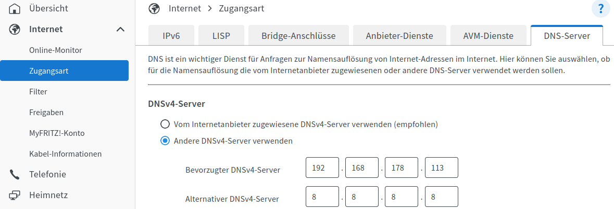

# RasPi: pihole.fritz.box

This RasPi node runs Pi-hole to block ads on my local network.

## About this Raspberry Pi
[Pi-hole](https://docs.pi-hole.net) is a Linux network-level advertisement and Internet tracker blocking application which acts as a [DNS sinkhole](https://en.wikipedia.org/wiki/DNS_sinkhole) and optionally a [DHCP server](https://en.wikipedia.org/wiki/Dynamic_Host_Configuration_Protocol), intended for use on a private network. It is designed for low-power embedded devices with network capability, such as the [Raspberry Pi](https://en.wikipedia.org/wiki/Raspberry_Pi), but can be installed on almost any Linux machine.

This machine is not intended for development purposes so there is no need to push any data to Github. Therefore there is no SSH key configuration for GitHub on this machine. It is only possible to clone public repositories via HTTPS.

!!! note ""
    Raspberry Pi 4 Model B, 8 Gigabyte RAM, 32GB SD Card

## Operating System Setup
Use the "Raspberry Pi Imager" to install "{os}" onto a SD card. Use the following settings:

!!! warning
    Make sure to enter a valid hostname and user `sebastian` uses the correct password!

## Configuration and package installation
Steps to run on a normal workstation (= a machine with SSH access to the RasPi node - which is probably the one used to setup the SD card)

- Enable passwordless SSH connections (from workstation, not the RasPi node)
    - `ssh sebastian@pihole.fritz.box`
    - `ssh-copy-id sebastian@pihole.fritz.box`
- Router Settings
    - Always assign the same IP address to the RasPi node
- Configuration and package installations
    - Apply ansible configs for RasPi node from this repo (`xref:AUTO-GENERATED:bash-docs/components/homelab/src/main/ansible-cli-sh.adoc[components/homelab/src/main/ansible-cli.sh]`)
    - There is no need for a dedicated service startup script as Pi-hole and all other services are started via Docker Compose from Ansible.
- Router Settings
    - Use Pi-hole as DNS server for the local network
        - Configure your router's DHCP options to force clients to use Pi-hole as their DNS server. In this case, use `192.168.178.113` as the DNS server.
        - The FritzBox expects an alternative DNS server. Use `8.8.8.8` which is part of link:https://en.wikipedia.org/wiki/Google_Public_DNS[Google's public DNS servers].

See `components/docker-stacks/pihole/docker-compose.yml` for details about the pi-hole config.

## Pi-hole management interface
See http://pihole.fritz.box/admin for the Pi-hole management interface. Password can be found in the docker compose file.
