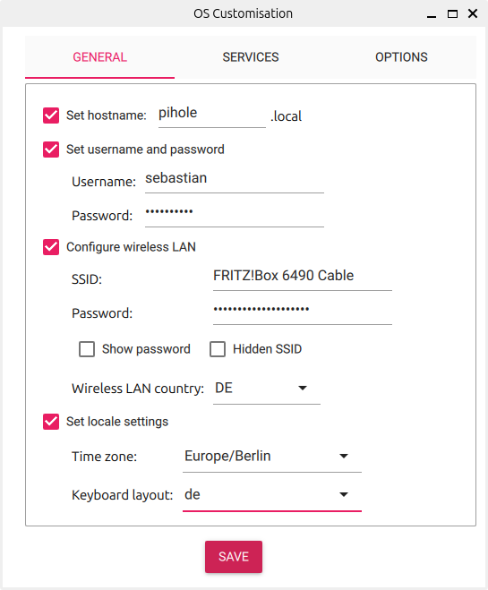
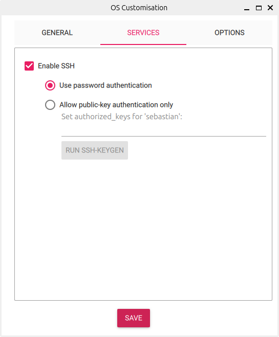
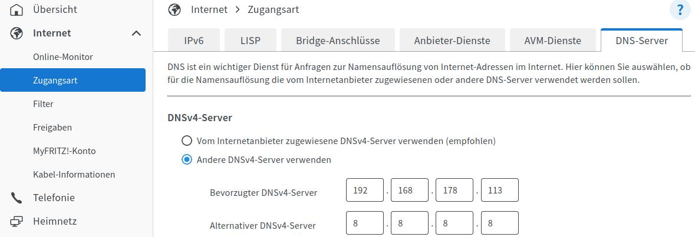

# pihole.fritz.box

This RasPi node runs Pi-hole to block ads on my local network.

## About this Raspberry Pi

[Pi-hole](https://docs.pi-hole.net) is a Linux network-level advertisement and Internet tracker blocking application which acts as a [DNS sinkhole](https://en.wikipedia.org/wiki/DNS_sinkhole) and optionally a [DHCP server](https://en.wikipedia.org/wiki/Dynamic_Host_Configuration_Protocol), intended for use on a private network. It is designed for low-power embedded devices with network capability, such as the [Raspberry Pi](https://en.wikipedia.org/wiki/Raspberry_Pi), but can be installed on almost any Linux machine.

This machine is not intended for development purposes so there is no need to push any data to Github. Therefore there is no SSH key configuration for GitHub on this machine. It is only possible to clone public repositories via HTTPS.

!!! note ""
    Raspberry Pi 4 Model B, 8 Gigabyte RAM, 32GB SD Card

## Operating System Setup

Use the "Raspberry Pi Imager" to install Ubuntu Server onto a SD card. Use the following settings:

!!! warning
    Make sure to enter a valid hostname and user `sebastian` uses the correct password!

## Configuration and package installation

Steps to run on a normal workstation (= a machine with SSH access to the RasPi node - which is probably the one used to setup the SD card)

- [ ] Enable passwordless SSH connections (from workstation, not the RasPi node)
    - [ ] `ssh sebastian@pihole.fritz.box`
    - [ ] `ssh-copy-id sebastian@pihole.fritz.box`
- [ ] Router Settings
    - [ ] Always assign the same IP address to the RasPi node
- [ ] Configuration and package installations
    - [ ] Apply ansible configs for RasPi node from this repo (`xref:AUTO-GENERATED:bash-docs/components/homelab/src/main/ansible-cli-sh.adoc[components/homelab/src/main/ansible-cli.sh]`)
    - [ ] There is no need for a dedicated service startup script as Pi-hole and all other services are started via Docker Compose from Ansible.
- [ ] Router Settings
    - [ ] Use Pi-hole as DNS server for the local network
        - [ ] Configure your router's DHCP options to force clients to use Pi-hole as their DNS server. In this case, use `192.168.178.113` as the DNS server.
        - [ ] The FritzBox expects an alternative DNS server. Use `8.8.8.8` which is part of [Google's public DNS servers](https://en.wikipedia.org/wiki/Google_Public_DNS).

## Pi-hole management interface

See <http://pihole.fritz.box/admin> for the Pi-hole management interface. Password can be found in the docker compose file.

## Docker Compose Config

The `pihole` Docker stack starts pi-hole which acts as a [DNS sinkhole](https://en.wikipedia.org/wiki/DNS_sinkhole) to block unwanted traffic. Pi-hole is a Linux network-level advertisement and Internet tracker blocking application which acts.

See <https://github.com/pi-hole/docker-pi-hole?tab=readme-ov-file##quick-start>

### Setting Up Pi-hole for Ad-Blocking Only

If you prefer to keep your existing router's DHCP service and only want to use Pi-hole for ad-blocking, you can do so with the following steps:

- Install and Configure Pi-hole: Follow the standard installation process for Pi-hole on your Raspberry Pi or other server.
- Configure Router's DNS Settings: Set your router's DNS server settings to use the IP address of your Pi-hole instance. This ensures that all DNS requests from devices on your network are routed through Pi-hole.
- Disable Pi-hole's DHCP Server: By default, Pi-hole's DHCP server is disabled. Ensure it remains disabled if you do not want Pi-hole to handle DHCP. You can verify this in the Pi-hole web interface under Settings > DHCP.
- Test Configuration: Verify that your devices are using Pi-hole for DNS by checking the DNS server settings on a few devices. You can also check the Pi-hole query log to see if DNS requests are being processed.

### Advantages of Using Pi-hole as a DHCP Server

- Consistent Network-Wide Ad-Blocking: When Pi-hole is used as a DHCP server, it ensures that all devices on your network use Pi-hole as their DNS server. This avoids potential issues where devices might bypass Pi-hole if they are manually configured or use alternative DNS settings.
- Device-Specific Blocking and Statistics: Pi-hole can provide more detailed statistics and logs, showing which devices are making DNS requests. This can help you understand the ad traffic on a per-device basis and customize blocking accordingly.
- Ease of Management: Managing DHCP and DNS settings through Pi-hole's web interface can be simpler than dealing with your router's interface, especially if your router has limited DHCP and DNS configuration options.
- Advanced Features: Pi-hole's DHCP server supports advanced features like static DHCP leases, which can assign fixed IP addresses to specific devices. This can be useful for network organization and management.
- No Need to Configure Router's DNS Settings: When using Pi-hole as the DHCP server, it automatically assigns itself as the DNS server for all devices. This means you don't have to manually configure the DNS settings on your router, which can sometimes be a limitation on certain routers.

### Summary

Using Pi-hole as a DHCP server can simplify network-wide DNS management and provide enhanced monitoring and control over individual devices. However, if your primary goal is ad-blocking, configuring your router to use Pi-hole as the DNS server without changing the DHCP server is perfectly fine and may be easier to manage. The choice depends on your specific needs and network setup.

#### Setup of choice

Pi-hole is set up as a DNS sinkhole only. The router's DHCP server is used.
