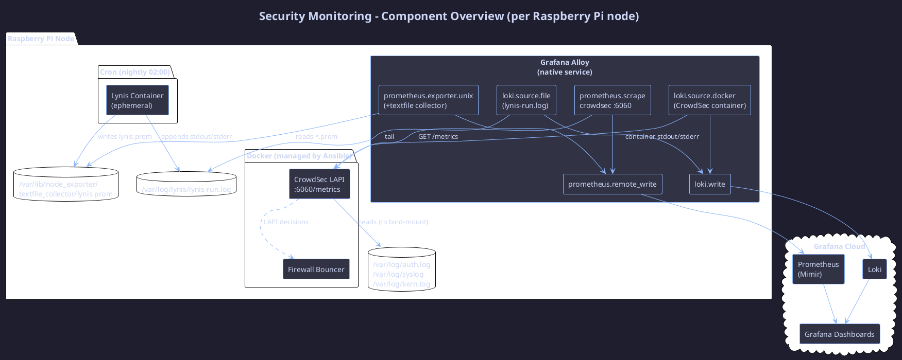
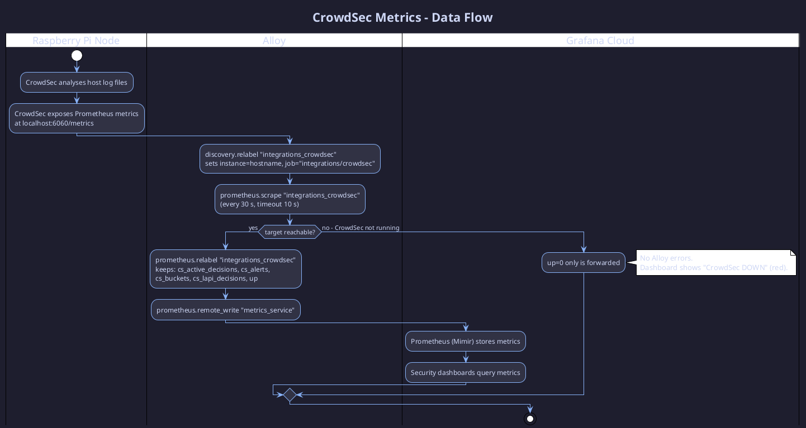
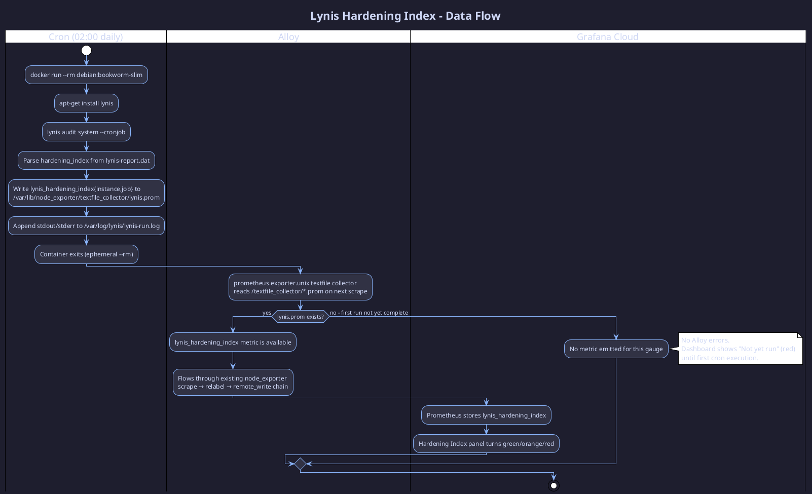
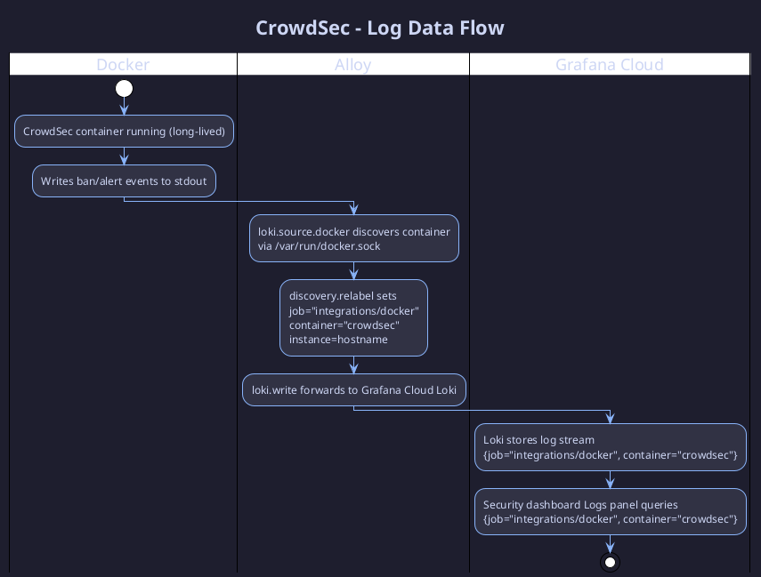
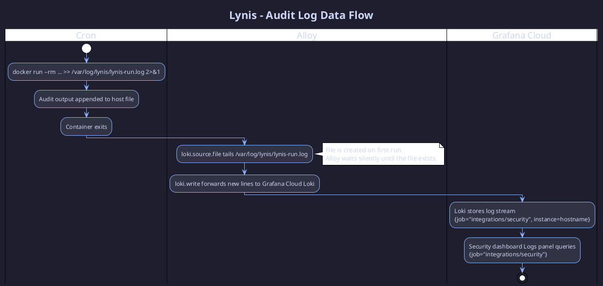
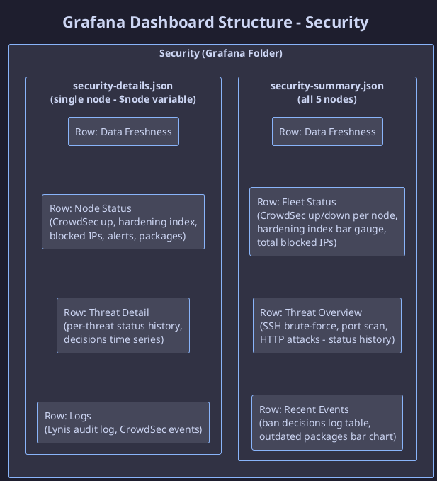

# Security Monitoring – Raspberry Pi Nodes

This page describes the security monitoring setup deployed across all five Raspberry Pi nodes (`pi4-01` through `pi5-01`). The stack is designed to detect intrusions in real time, audit system hardening nightly, and surface all findings in Grafana Cloud — with zero custom middleware between the data sources and Alloy.

---

## Overview

Two complementary tools form the security layer:

- **[CrowdSec](https://www.crowdsec.net/)** – a real-time behavioural intrusion-detection system that analyses logs, detects threats (SSH brute-force, port scans, HTTP attacks), and applies iptables/nftables bans via a local firewall bouncer.
- **[Lynis](https://cisofy.com/lynis/)** – a nightly system-hardening audit that produces a hardening index (0–100) and a detailed report. It runs as an ephemeral Docker container triggered by cron.

Both data sources feed into the existing [Grafana Alloy](../../ansible/roles/grafana-cloud/alloy.md) telemetry pipeline without any custom HTTP servers or middleware. Alloy scrapes CrowdSec's built-in Prometheus endpoint directly and reads Lynis metrics from a textfile written by the cron job.

---

## Architecture

### Component Overview

### Key design decisions

- **No custom HTTP servers or middleware.** CrowdSec exposes a built-in Prometheus endpoint at `:6060/metrics`; Alloy scrapes it directly. Lynis writes a `.prom` textfile that Alloy's `prometheus.exporter.unix` textfile collector reads on every scrape cycle. No Pushgateway, no Python scripts.
- **Alloy is error-tolerant.** When a scrape target is unreachable (e.g., CrowdSec not yet deployed), Alloy records `up=0` and forwards nothing else to Grafana Cloud. No error is raised. The same applies to `loki.source.file` — if the Lynis log file does not yet exist, Alloy waits silently.
- **Ephemeral container logs are captured via file-tail.** The Lynis container exits before `loki.source.docker` can discover it. The cron job redirects all output to `/var/log/lynis/lynis-run.log`, which Alloy tails with `loki.source.file`.

---

## Data Flow – Metrics

### CrowdSec Metrics Pipeline

### Lynis Hardening Index Pipeline

---

## Data Flow – Logs

### CrowdSec Container Logs

CrowdSec runs as a long-lived Docker container. Alloy's `loki.source.docker` discovers it automatically and forwards its stdout/stderr to Grafana Cloud Loki with the labels `job="integrations/docker"` and `container="crowdsec"`.

### Lynis Audit Logs

The Lynis container is ephemeral (exits after the audit). Alloy cannot use `loki.source.docker` for it. Instead, the cron job appends all output to a persistent host-side log file that Alloy tails with `loki.source.file`.

---

## Grafana Dashboards

Two dashboards are provisioned under the **Security** folder in Grafana Cloud via git-sync:

| Dashboard | UID | Purpose |
|---|---|---|
| `security-summary.json` | `security-raspi-summary` | Fleet-wide view across all 5 Pi nodes |
| `security-details.json` | `security-raspi-details` | Per-node deep-dive (node selected via template variable) |

### Data Freshness Row

Both dashboards open with a mandatory **Data Freshness** row. These stat panels show when metrics and logs were last successfully received, so a silent failure (exporter down, cron not running) is immediately visible:

| Panel | Datasource | Query | Green | Yellow | Red |
|---|---|---|---|---|---|
| Metrics Last Received – CrowdSec | Prometheus | `time() - timestamp(up{job="integrations/crowdsec",...})` | < 120 s | < 300 s | ≥ 300 s |
| Metrics Last Received – Node Exporter | Prometheus | `time() - timestamp(up{job="integrations/node_exporter",...})` | < 180 s | < 600 s | ≥ 600 s |
| Metrics Last Received – Lynis Index | Prometheus | `time() - timestamp(lynis_hardening_index{...})` | < 86 400 s | < 172 800 s | ≥ 172 800 s |
| Logs Last Received – Lynis Audit | Loki | `count_over_time({job="integrations/security"}[25h])` | > 0 | – | = 0 |
| Logs Last Received – CrowdSec | Loki | `count_over_time({job="integrations/docker",container="crowdsec"}[15m])` | > 0 | – | = 0 |

### Dashboard Structure

---

## Ansible Deployment

The security stack is deployed by the dedicated playbook `ansible/playbooks/deploy-security-stack.yml`, which targets the `raspi` inventory group. It uses the `security/crowdsec-lynis` Ansible role to:

1. Create `/opt/security-stack/` on each node.
2. Copy the Docker Compose file and CrowdSec acquisition config.
3. Template the `.env` file (with vault-encrypted secrets) at `mode: 0600`.
4. Ensure `/var/log/lynis/` and `/var/lib/node_exporter/textfile_collector/` exist.
5. Start the stack with `community.docker.docker_compose_v2`.
6. Schedule the Lynis nightly cron job (02:00 daily, owned by `sebastian`).

After running the security playbook, re-run the grafana-agents playbook to push the extended `config.alloy` (with the CrowdSec scrape block and Lynis file-tail) to all nodes.

---

## Security Considerations

- `ansible/vars/security-vault.yml` is Ansible Vault encrypted. The vault password is never committed.
- The `.env` file on each node is written with `mode: 0600`, owned by `sebastian`.
- The firewall bouncer runs with `NET_ADMIN` and `NET_RAW` capabilities and `network_mode: host`. This is required for iptables/nftables rule injection.
- The Lynis container mounts `/:/hostfs:ro` and `--pid=host` to audit the actual host OS. It has no persistent write access beyond `/var/log/lynis/` and `/var/lib/node_exporter/textfile_collector/`.
- CrowdSec mounts `/var/log:/var/log:ro` — read-only access to host logs only.
